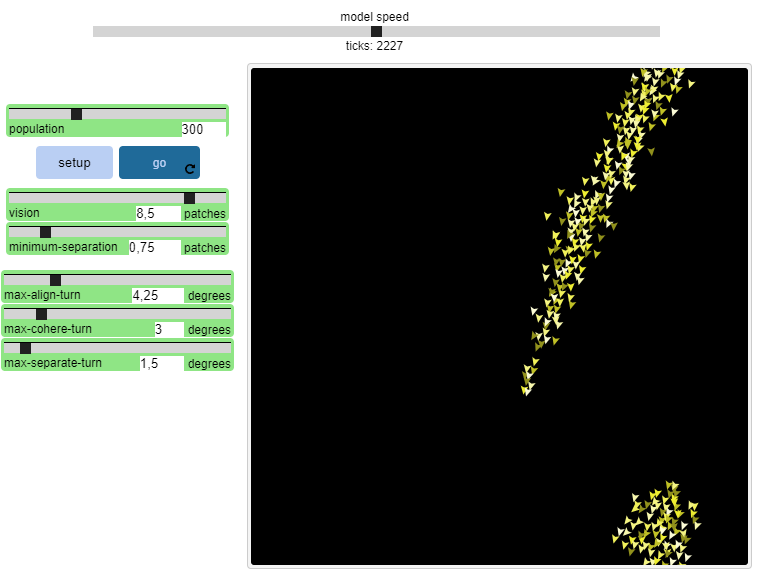
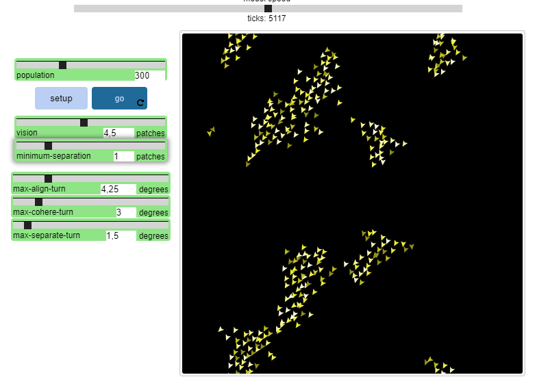
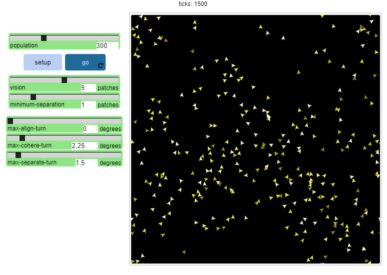
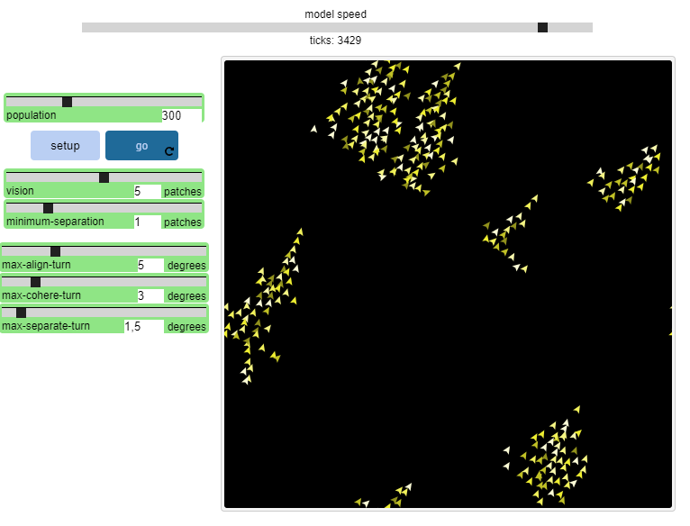

## Імітаційне моделювання комп'ютерних систем
## СПм-21-2, **Кравець Владислав Євгенович**
### Лабораторна робота №**1**. Опис імітаційних моделей та проведення обчислювальних експериментів

 

### Вибрана модель у середовищі NetLogo:
[Flocking](http://www.netlogoweb.org/launch#http://www.netlogoweb.org/assets/modelslib/Sample%20Models/Biology/Flocking.nlogo)

 

### Вербальний опис моделі:
Ця модель є спробою імітувати зграї птахів. (Результуючий рух також нагадує зграї риб.) Зграї, які з’являються в цій моделі, не створюються та не керуються жодним чином спеціальними птахами-лідерами. Навпаки, кожен птах дотримується тих самих правил, за якими з’являються зграї.

### Як це працює:
Птахи дотримуються трьох правил: «вирівнювання», «відокремлення» і «згуртованість».
«Вирівнювання» означає, що птах має тенденцію повертатися так, щоб він рухався в тому ж напрямку, що й сусідні птахи.
«Відокремлення» означає, що птах повернеться, щоб уникнути іншого птаха, який наближається надто близько.
«Згуртованість» означає, що птах рухатиметься до інших птахів поблизу (якщо інший птах не знаходиться надто близько).
Коли два птахи знаходяться надто близько, правило «відокремлення» перекриває двох інших, які дезактивуються, доки не буде досягнуто мінімального відриву.
Три правила впливають лише на курс птаха. Кожен птах завжди рухається вперед з однаковою постійною швидкістю.

### Керуючі параметри:
Спочатку визначте кількість птахів, яку ви хочете взяти в симуляції, і встановіть повзунок POPULATION на це значення.
Параметри за замовчуванням для повзунків забезпечать досить хорошу поведінку флокування. Однак ви можете пограти з ними, щоб отримати варіації:
Три повзунки TURN-ANGLE регулюють максимальний кут, на який може повернутися птах відповідно до кожного правила.
VISION – це відстань, яку кожен птах може бачити на 360 градусів навколо себе.

 

## Обчислювальні експерименти

### 1. Пограйте з повзунками, щоб побачити, чи можна отримати щільніші зграї, більше зграй, більшу чи меншу перестановку птахів у зграях тощо.

	

### 2. Ви можете повністю вимкнути правило, установивши повзунок кута цього правила на нуль. Чи достатньо одного правила, щоб створити хоч якийсь флок? А як щодо двох правил? Чого не вистачає в кінцевій поведінці, коли ви пропускаєте кожне правило?

Вимкнення кожного правила заважає птахам триматись зграї.

### 3. Чи спричинить тривалий запуск моделі статичну зграю? Або птахи ніколи не приживуться до незмінної формації?

